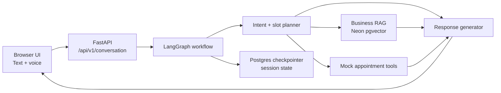

# Enterprise Voice AI Agent

Production demo: [enterprise-voice-ai-agent.vercel.app](https://enterprise-voice-ai-agent.vercel.app)

An enterprise-style AI receptionist for appointment-based businesses. The project demonstrates one LangGraph workflow adapting at runtime to three business profiles: dental clinic, salon, and auto repair shop.

The assistant can answer business-specific questions through profile-scoped RAG, collect missing appointment details across turns, execute mock transactional tools, and maintain one active appointment inside a conversation session.

## What It Demonstrates

- LangGraph state orchestration with explicit routing, slot filling, and response generation
- Runtime business configuration without duplicating the graph
- Profile-scoped RAG for services, pricing, hours, policies, and FAQs
- Tool execution for booking, cancellation, rescheduling, and human escalation
- Browser voice input/output with a text fallback
- Production deployment on Vercel with Neon PostgreSQL for RAG and graph checkpointing

## Demo Profiles

| Business Type | Example Name | Knowledge Base |
| --- | --- | --- |
| Dental Clinic | BrightSmile Dental | Cleanings, whitening, emergency visits, policies, hours |
| Salon | Luxe Hair Studio | Haircuts, coloring, styling, bridal services, policies, hours |
| Auto Repair Shop | TurboFix Garage | Oil changes, brakes, diagnostics, tires, policies, hours |

The business name personalizes the greeting only. Services, pricing, policies, and tool behavior are controlled by the selected business type.

## Core Architecture



The important design principle is:

> One LangGraph workflow adapts to multiple appointment-based businesses through runtime configuration while keeping orchestration logic unchanged.

## Supported Workflows

- Ask business questions: services, prices, hours, policies, and common questions
- Book an appointment with multi-turn slot filling
- Cancel the active appointment in the same session
- Reschedule the active appointment in the same session
- Escalate to a human

Appointment management is intentionally simple. Version 1 supports one active appointment per conversation session:

```yaml
active_appointment:
  service: string
  date: string
  time: string
  status: confirmed | cancelled | rescheduled
```

There are no customer accounts, booking IDs, calendar integrations, or cross-session scheduling workflows in this version.

## Tech Stack

- Frontend: HTML, CSS, vanilla JavaScript
- Voice: Browser Speech Recognition API and Speech Synthesis API
- Backend: FastAPI
- Orchestration: LangGraph
- LLM and embeddings: OpenAI
- Retrieval: Neon PostgreSQL with pgvector
- Persistence: LangGraph Postgres checkpointing
- Deployment: Vercel

## Local Setup

Create and activate a virtual environment:

```powershell
python -m venv .venv
.\.venv\Scripts\Activate.ps1
```

Install dependencies:

```powershell
python -m pip install --upgrade pip
python -m pip install -r requirements.txt -r requirements-dev.txt
```

Create your local environment file:

```powershell
Copy-Item .env.example .env
```

Fill in:

```text
OPENAI_API_KEY=
DATABASE_URL=
OPENAI_MODEL=
OPENAI_EMBEDDING_MODEL=
OPENAI_EMBEDDING_DIMENSIONS=
RAG_TOP_K=
LANGGRAPH_STRICT_MSGPACK=true
```

Index the demo knowledge base into Neon:

```powershell
python -m backend.scripts.index_knowledge backend\data\knowledge
```

Run the app locally:

```powershell
python -m uvicorn backend.app.main:app --reload --port 8000
```

Open [http://127.0.0.1:8000](http://127.0.0.1:8000).

## API Smoke Test

```powershell
$body = @{
  message = "What does an oil change cost?"
  session_id = "demo-auto-001"
  business_type = "auto_repair"
  business_name = "TurboFix Garage"
} | ConvertTo-Json

Invoke-RestMethod `
  -Uri "http://127.0.0.1:8000/api/v1/conversation" `
  -Method Post `
  -ContentType "application/json" `
  -Body $body
```

## Test Suite

```powershell
python -m pytest --basetemp .pytest_tmp
python -m compileall backend
node --check public\app.js
python -m pip check
```

## Deployment Notes

Production lives on the `main` branch and is deployed to Vercel. The `local-dev` branch is kept as a local-first backup version that can be pulled later if local experiments go sideways.

Required Vercel environment variables:

- `OPENAI_API_KEY`
- `DATABASE_URL`
- `OPENAI_MODEL`
- `OPENAI_EMBEDDING_MODEL`
- `OPENAI_EMBEDDING_DIMENSIONS`
- `RAG_TOP_K`
- `LANGGRAPH_STRICT_MSGPACK`

The production build uses:

- `.python-version` for the Python runtime
- `pyproject.toml` and `uv.lock` for Vercel dependency installation
- `public/` for static frontend assets
- `.vercelignore` to keep local env files, tests, caches, and virtualenv files out of deployment bundles

## Demo Script

Try these prompts in the live app:

1. Select `Auto Repair Shop`, name it `TurboFix Garage`, then ask: `What does an oil change cost?`
2. Select `Dental Clinic`, name it `BrightSmile Dental`, then say: `Book a dental cleaning tomorrow at 2 PM.`
3. Continue in the same session: `Actually, cancel it.`
4. Select `Salon`, name it `Luxe Hair Studio`, then ask: `What is your cancellation policy?`

## Current Limits

- Transaction tools are mocked for demonstration
- Only one active appointment is tracked per conversation session
- Voice support depends on browser speech APIs, which work best in Chromium-based browsers
- No authentication, CRM, calendar, payment, or real business onboarding flow yet
